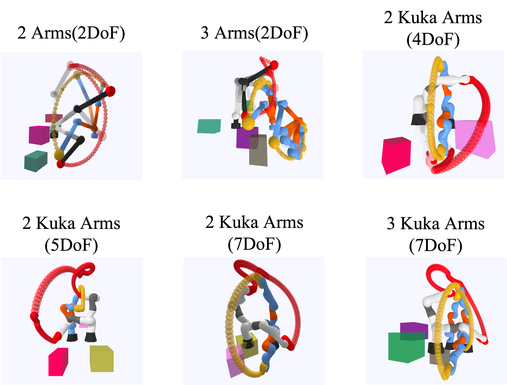

# Dynamic GNN Planning

This is the code for NeurIPS'22 paper Learning-based Motion Planning in Dynamic Environments Using GNNs and Temporal Encoding 

[paper](https://arxiv.org/abs/2210.08408) | [website](https://ruipengz.github.io/neurips22/)


## Installation
```bash
conda create -n Dynamic-GNN python=3.8
conda activate Dynamic-GNN
# install pytorch, modify the following line according to your environment
conda install pytorch torchvision cudatoolkit=11.3 -c pytorch
# install torch geometric, refer to https://github.com/pyg-team/pytorch_geometric
conda install pyg -c pyg
pip install pybullet transforms3d matplotlib
```

## Environment


## Testcases
### Available Testcases
 Please put /testcase into the root directory of this repo.

[**2arms**](https://drive.google.com/drive/folders/1AKG8ipsEqrVz7lqtSz0r8p5cnYEIKSCh?usp=sharing)
[**3arms**](https://drive.google.com/drive/folders/1-dMEbgdeoxHapOlHOy3eMbdQ86d19NIO?usp=sharing)
[**kuka**](https://drive.google.com/drive/folders/1lLwAkc4KTZDHEbYLBCdeVaDsA86gbM3I?usp=sharing)
[**3kuka**](https://drive.google.com/drive/folders/1QrcxibkCmBcwxs9IC6tyDeZT6gFQxqpq?usp=sharing)

### Generate testcases
```bash
# generate test cases for 2arms using multi-processing
python oracle/generate_testcases.py
```


